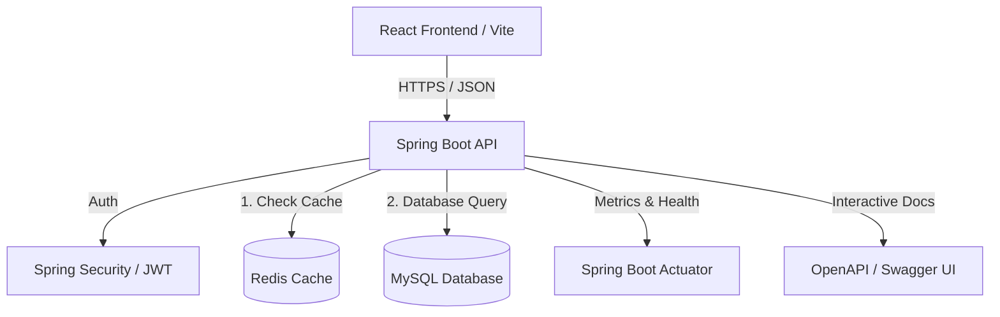

# 🛒 SmartCart — Enterprise E-Commerce Platform

A production-grade, high-performance e-commerce platform built using a modern decoupled architecture. The backend is powered by **Spring Boot**, **Spring Security + JWT**, and **MySQL**, utilizing **Redis** for sub-millisecond read caching, **Docker** for containerized orchestration, and comprehensive **JUnit 5 / Mockito** suites for robust test coverage.

---

## 🚀 Tech Stack

### ☕ Backend (Enterprise Java)
*   **Java 17 + Spring Boot 3.2**
*   **Spring Security & JWT Authentication** (Stateless, role-based RBAC)
*   **Spring Data JPA & Hibernate** (Optimistic locking, custom query indexing)
*   **MySQL 8** (Primary transactional database)
*   **Redis Caching** (Highly optimized for product catalog, search queries, and categories)
*   **JUnit 5 & Mockito** (20+ unit test scenarios covering critical path business logic)
*   **Spring Boot Actuator** (Production observability, metrics, health checks)
*   **Swagger / OpenAPI 3.0** (Self-documenting interactive API Playground, grouped by modules)

### ⚛️ Frontend (Client Application)
*   **React 18 + Vite 5**
*   **Tailwind CSS 3.4**
*   **React Router 6**
*   **Axios + Recharts** (Interactive administrative analytics)
*   **React Hot Toast** (Micro-animations and state notifications)

---

## 📦 Features

- 🔐 **Stateless JWT Security:** RBAC with custom `UserDetailsService`, secure BCrypt password encoding.
- ⚡ **Sub-Millisecond Redis Caching:** Optimized listing queries and detail retrievals with granular TTL policies.
- 📈 **Real-Time Analytics Dashboard:** Administrative visualization of daily revenue and order trends.
- 🛍 **E-Commerce Critical Paths:** Granular product filtering, real-time cart persistence, checkout address routing, and payment lifecycle callbacks.
- 💳 **Mock Gateway / Auto-Refunds:** Payment integration handling order creation, verification signatures, and automatic rollback/refunds on cancellation.
- 📁 **Production Observability:** Built-in actuator endpoints for live application health monitoring.

---

## 🏗 System & Caching Architecture



### ⚡ Caching Strategy (Redis)
To minimize database load and ensure maximum throughput, SmartCart implements Spring's `@Cacheable` abstraction backed by **Redis**:
1.  **Product Lists (`products`):** Cached for 10 minutes (TTL). Automatically invalidated (`@CacheEvict`) upon administrative creation, modification, or soft-deletion of products.
2.  **Product Details (`product-detail`):** Cached for 15 minutes by unique ID. Invalidated immediately when that specific product is updated or deleted.
3.  **Categories (`categories`):** Cached for 30 minutes. Invalidated on category updates.

---

## ⚙️ Development & Quickstart

### 📋 Prerequisites
*   **Java 17+**
*   **Node.js 18+**
*   **Docker & Docker Compose** (highly recommended)

### 🐳 1. Run Everything via Docker Compose (Recommended)
You can start the entire application—including the MySQL database, Redis instance, backend, and frontend—with a single command:
```bash
docker compose up --build
```
*   **Frontend:** `http://localhost:3000`
*   **Backend REST API:** `http://localhost:8080`
*   **Swagger UI (API Docs):** `http://localhost:8080/swagger-ui.html`

### 🔑 Default Credentials

| Role  | Email               | Password   |
|-------|---------------------|------------|
| Admin | `admin@smartcart.com` | `Admin@123`  |
| User  | `john@example.com`    | `User@123`   |

---

## 🧪 Testing Suite (JUnit 5 + Mockito)

SmartCart implements a professional test suite featuring Mockito mocking, boundary verification, and custom exception asserting:
*   **AuthServiceTest:** Registration validation, duplicate email assertions, password encoding checks, login state verification.
*   **ProductServiceTest:** Caching check logic, exception assertions for invalid IDs, paged response transformations.
*   **CartServiceTest:** Inactive product blocks, stock boundary assertions, cart generation on demand.
*   **OrderServiceTest:** Stock deduction, address validation, cancel status propagation and stock recovery.

Run the test suite using Maven:
```bash
cd smartcart-backend
mvn clean test
```

---

## 🛠 Active API Endpoints

Our endpoints are split into structural Swagger groups:

| Group | Endpoint | Method | Role | Description |
|---|---|---|---|---|
| **1. Auth** | `/api/auth/register` | `POST` | Public | Registers user and assigns USER role. |
| **1. Auth** | `/api/auth/login` | `POST` | Public | Returns stateful JWT token. |
| **2. Products** | `/api/products` | `GET` | Public | Paged & cached product list. |
| **2. Products** | `/api/products/{id}` | `GET` | Public | Cached product details. |
| **3. Cart** | `/api/cart` | `GET` | User | Fetch user's cart state. |
| **3. Cart** | `/api/cart/add` | `POST` | User | Add products to cart. |
| **4. Orders** | `/api/orders` | `POST` | User | Place order and reserve stock. |
| **6. Admin** | `/api/admin/dashboard` | `GET` | Admin | Multi-dimensional financial analytics. |
