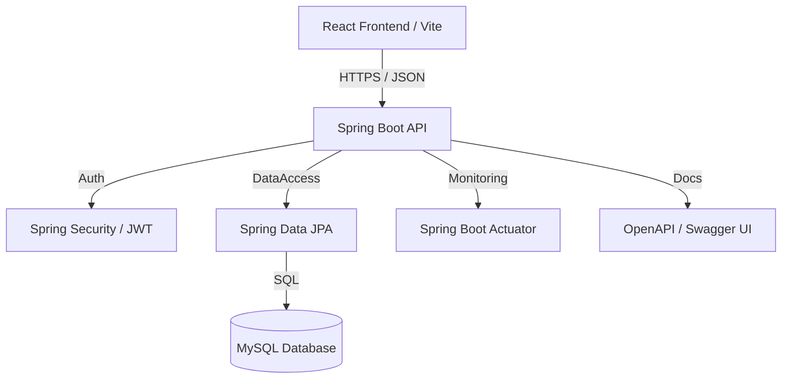

# SmartCart — Full-Stack E-Commerce Platform

A production-ready e-commerce application built with **Spring Boot** (backend) and **React + Vite + Tailwind CSS** (frontend).

---

## 🚀 Tech Stack

### Backend
- Java 17 + Spring Boot 3.2
- Spring Security + JWT Authentication
- Spring Data JPA + Hibernate
- MySQL Database
- Swagger/OpenAPI Documentation
- Maven

### Frontend
- React 18 + Vite 5
- Tailwind CSS 3.4
- React Router 6
- Axios + Recharts
- React Hot Toast

---

## 📦 Features

- ✅ JWT-based Authentication (User + Admin roles)
- ✅ Product browsing with search, filter, sort, pagination
- ✅ Shopping cart with real-time updates
- ✅ Checkout with address management
- ✅ Order placement and tracking
- ✅ Mock payment processing
- ✅ User dashboard (profile, addresses, orders)
- ✅ Admin panel with **Real-time Analytics Dashboard**
- ✅ Admin product/order/user/category management
- ✅ Image upload support
- ✅ Swagger API documentation
- ✅ **Production Observability:** Spring Boot Actuator integration
- ✅ **Automated Testing:** JUnit 5, Mockito, and Spring MockMvc
- ✅ Responsive design (mobile + desktop)

---

## 🏗 System Architecture



---

## 💎 Technical Rigor

This project demonstrates several high-level engineering standards:
- **Clean Architecture:** Strict separation of DTOs, Controllers, Services, and Repositories.
- **Security First:** Stateless JWT authentication with secure password hashing and Role-Based Access Control (RBAC).
- **Automated Testing:** Unit tests for business logic and Integration tests for API endpoints.
- **Observability:** Built-in health checks and system metrics via Actuator endpoints.
- **Optimized DevOps:** Dockerized environment with multi-stage builds and automated database readiness synchronization.

---

## ⚙️ Prerequisites

- Java 17+
- Node.js 18+
- MySQL 8.0+ / MariaDB
- Maven 3.8+

---

## 🛠️ Installation & Setup

### 1. Database Setup
Create a database named `smartcart_db` on port `3307` (default development port configured in application.properties) or update `smartcart-backend/src/main/resources/application.properties` to match your local setup:
```sql
CREATE DATABASE IF NOT EXISTS smartcart_db;
```

### 2. Backend
Navigate to the backend directory and run:
```bash
cd smartcart-backend

# Package and run the Spring Boot application
./mvnw spring-boot:run
```
Backend will start at **http://localhost:8080**  
Swagger API Docs: **http://localhost:8080/swagger-ui.html**

### 3. Frontend
Navigate to the frontend directory, install dependencies, and run:
```bash
cd smartcart-frontend

# Install dependencies
npm install

# Start Vite development server
npm run dev
```
Frontend will start at **http://localhost:5173**

---

## 🚀 Easy Start Scripts (Windows)

For your convenience, I have provided two scripts to start the application with one click:

1. **`start-app.bat`**: Runs the entire application (DB + Backend + Frontend) using **Docker Compose**. Recommended for a consistent environment.
2. **`run-locally.bat`**: Runs the Backend (Maven) and Frontend (NPM) in parallel windows. Use this if you want to run directly on your host machine (ensure MySQL is running on port 3306).

---

## 🔑 Default Credentials

| Role  | Email               | Password   |
|-------|---------------------|------------|
| Admin | admin@smartcart.com | Admin@123  |
| User  | john@example.com    | User@123   |

---

## 📁 Project Structure

```
smartcart-backend/
├── src/main/java/com/smartcart/
│   ├── config/          # Security, JWT, CORS, Swagger config
│   ├── controller/      # REST API controllers
│   ├── dto/             # Data Transfer Objects
│   ├── entity/          # JPA entities
│   ├── enums/           # Role, OrderStatus, PaymentStatus
│   ├── exception/       # Global exception handling
│   ├── repository/      # Spring Data JPA repositories
│   └── service/         # Business logic services
└── src/main/resources/
    └── application.properties

smartcart-frontend/
├── src/
│   ├── api/             # Axios config + API service modules
│   ├── components/      # Header, Footer, ProductCard, Shared
│   ├── context/         # AuthContext, CartContext
│   └── pages/           # All page components
│       └── admin/       # Admin panel pages
├── index.html
├── tailwind.config.js
└── vite.config.js
```

---

## 🛠 API Endpoints

| Module     | Endpoint                    | Method | Auth   |
|------------|-----------------------------|--------|--------|
| Auth       | `/api/auth/register`        | POST   | Public |
| Auth       | `/api/auth/login`           | POST   | Public |
| Products   | `/api/products`             | GET    | Public |
| Products   | `/api/products/{id}`        | GET    | Public |
| Products   | `/api/products/search`      | GET    | Public |
| Products   | `/api/products/filter`      | GET    | Public |
| Categories | `/api/categories`           | GET    | Public |
| Cart       | `/api/cart`                 | GET    | User   |
| Cart       | `/api/cart/add`             | POST   | User   |
| Orders     | `/api/orders`               | GET/POST| User  |
| Users      | `/api/users/profile`        | GET/PUT| User   |
| Users      | `/api/users/addresses`      | CRUD   | User   |
| Admin      | `/api/admin/dashboard`      | GET    | Admin  |
| Admin      | `/api/admin/products`       | CRUD   | Admin  |
| Admin      | `/api/admin/orders`         | GET/PUT| Admin  |
| Admin      | `/api/admin/users`          | GET/PUT| Admin  |
| Admin      | `/api/admin/categories`     | CRUD   | Admin  |
